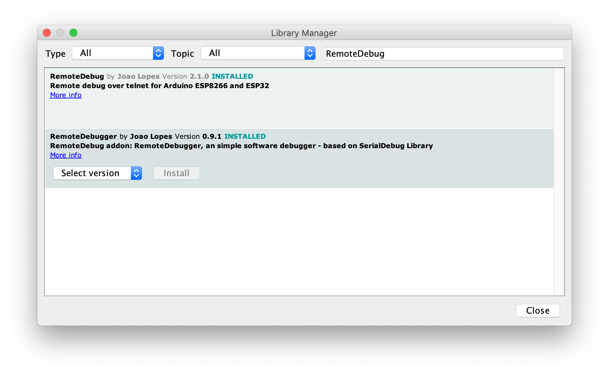

# RemoteDebugger Library for Arduino

Addon library to __[RemoteDebug](https://github.com/JoaoLopesF/RemoteDebug)__: An Simple Software Debugger, based on __[SerialDebug](https://github.com/JoaoLopesF/SerialDebug)__


[](https://www.ardu-badge.com/RemoteDebugger)
[](#releases)
[](https://app.codacy.com/app/JoaoLopesF/RemoteDebugger?utm_source=github.com&utm_medium=referral&utm_content=JoaoLopesF/RemoteDebugger&utm_campaign=Badge_Grade_Settings)
[](https://github.com/JoaoLopesF/RemoteDebugger/blob/master/LICENSE.txt)
[](http://github.com/JoaoLopesF/RemoteDebugger/issues)
[](http://github.com/JoaoLopesF/RemoteDebugger)

__RemoteDebuggger__ is an addon to __[RemoteDebug](https://github.com/JoaoLopesF/RemoteDebug)__ library,
with and __simple software debugger__,
to see/change global variables, to add watch for these variables,
or call a function, in runtime, using commands by telnet.

## Contents

- [About](#about)
- [How it looks](#how-it-looks)
- [News](#news)
- [Beta version](#beta-version)
- [Github](#github)
- [Benefits](#benefits)
- [Commands](#commands)
- [Install](#install)
- [Usage](#usage)
- [Khow issues](#khow-issues)
- [Releases](#releases)
- [Links](#links)
- [Thanks](#thanks)

## About

This library is a addon, and need that the __[RemoteDebug](https://github.com/JoaoLopesF/RemoteDebug)__ library installed too.

The Arduino official IDE, not have debugger.
Only way, until now, is using a another IDE, that can be paid, and a hardware debugger, as JTAG.

__[SerialDebug](https://github.com/JoaoLopesF/SerialDebug)__ is an library to Improved serial debugging and simple software debugger to Arduino.
It is made for serial debugging over USB conexion. And it have a simple sofware debugger, simple but functional,
and not need a extra hardware to do it.

Yes, now we can use this debugger,

__RemoteDebuggger__ (this library), is a addon to __RemoteDebug__, to implement the simple software debugger,
based in __SerialDebug__.

Notes:

- This not good as a real hardware debugger, as GBD with JTAG USB hardware.
  And hardware debuggers require skills to configure and use.
  Few Arduino developers use it (e.g. Arduino IDE not have this feature).
  But RemoteDebugger is simple and funcional and works wireless, by WiFi (telnet connection).
- This not is a C++ class, like __RemoteDebug__,
  due keep code compatibility with __SerialDebug__.
  With it, all your debugger codes, by serial or telnet, is same.

It is an addon, due not overhead projects with __RemoteDebug__, that not needs an debugger.

## How it looks

__RemoteDebuggger__ in telnet client:

Image:


## News

### 2019-02-28

- The new version of __[RemoteDebug](https://github.com/JoaoLopesF/RemoteDebug)__, the 2.0.0, implements an support to __RemoteDebuggger__, few code added, just some callbacks. Please update this, if you have olders versions of RemoteDebug.

## Beta version

This is a beta version.
Not yet fully tested, optimized, and documented.

This is a previous documentation.
It will be better documented before first RC version.

## Github

Contribute to this library development by creating an account on GitHub.

Please give a star, if you find this library usefull,
this help a another people, discover it too.

Please add a issue for problems or suggestion.

I suggest you use a Github Desktop New app to clone,
it help to keep updated.

## Benefits

This debugger is __optimized__ for features that it have:

  The initial status of debugger is inactive,
  where no CPU waste time for process debugger elements.
  Well, there may not be anyone seeing it.

  After the telnet client connection, the debugger will become active.
  If it is desconnected, the debugger is disable too.

  For simple software debugger, have memory optimizations:

- No fixed arrays, is used C++ Vector to dynamic arrays

- Is used void* pointer to store values, when it is need.
  s more complicate, but it dramatically reduces use of memory,
  compared to store 17 variables for support 17 kinds of this.

  Note: due a extra overhead in processing simple software debugger,
        it starts disabled. You can enable when you need (dbg command)

  In future versions, the debugger will more otimized, for CPU and memory

## Commands

__RemoteDebug__ process commands by telnet connection.
__RemoteDebuggger__ receive it by callbacks and process predefined commands as:

      f -> call the function
          f ?  -> to show more help

      dbg [on|off] -> enable/disable the simple software debugger

      Only if debugger is enabled:
          g -> see/change global variables
            g ?  -> to show more help
          wa -> see/change watches for global variables
            wa ?  -> to show more help

      Not yet implemented:
        gpio -> see/control gpio

For simple software debugger:

    - For functions:

      - To show help: f ?
      - To show: f [name|num]
      - To search with start of name (case insensitive): f name
      - To call it, just command: f [name|number] [arg]

    - Enable/disable the debugger:

      - To enable: dbg on
      - To disable: dbg off

      Note: the debugger starts disabled, to avoid extra overhead to processing it
      You can enable it when need

    - For global variables:

      - To show help: g ?
      - To show: g [name|num]
      - To search by start of name: g name
      - To change global variable, g [name|number] = value [y]
        note: y is to confirm it (without confirm message)

    - For watches:

      - To show help: wa ?
      - To show: wa [num]
      - To add: wa a {global [name|number]} [==|!=|<|>|<=|>=|change] [value] [as]
        notes: change not need a value, and as -> set watch to stop always
      - To add cross (2 globals): wa ac {global [name|number]} [=|!=|<|>|<=|>=] {global [name|number]} [as]
      - To change: wa u {global [name|number]} [==|!=|<|>|<=|>=|change] [value] [as]
      - To change cross (not yet implemented)
      - To disable: wa d [num|all]
      - To enable: wa e [num|all]
      - To nonstop on watches: wa ns
      - To stop on watches: wa s

## Install

Just download or clone this repository.

Or for Arduino IDE, you  can use the library manager to install and update the library.
<!-- For install help, please see: [https://www.arduino.cc/en/Guide/Libraries](https://www.arduino.cc/en/Guide/Libraries) -->
For install help, click on this: [](https://www.ardu-badge.com/RemoteDebugger)


_Note: insure that both libraries are installed_

Please open the example project, to see it working.

## Usage

To add __RemoteDebuggger__ to your Arduino project (that uses __RemoteDebug__):

### include

Place it, after include of RemoteDebug:

```cpp
// RemoteDebug addon library: RemoteDebugger, an Simple software debugger - based on SerialDebug Library

#include "RemoteDebugger.h"    //https://github.com/JoaoLopesF/RemoteDebugger
```

### setup

Converter:

  __RemoteDebugger__ has a converter to help add this debugger to your Arduino codes,
  that uses __RemoteDebug__ library.

  [RemoteDebuggerConverter](https://github.com/JoaoLopesF/RemoteDebuggerConverter)

To do it manually:

Place it, after the RemoteDebug commands (Debug.begin, Debug.set...)

```cpp
// Init the simple software debugger, based on SerialDebug library

Debug.initDebugger(debugGetDebuggerEnabled, debugHandleDebugger, debugGetHelpDebugger, debugProcessCmdDebugger); // Set the callbacks

debugInitDebugger(&Debug); // Init the debugger
````

To add elements to debugger, put this codes, after the debugInitDebugger:

For example, for __functions__:

```cpp
// Add functions that can called from RemoteDebuggger

if (debugAddFunctionVoid("benchInt", &benchInt) >= 0) {
  debugSetLastFunctionDescription("To run a benchmark of integers");
}
if (debugAddFunctionVoid("benchFloat", &benchFloat) >= 0) {
  debugSetLastFunctionDescription("To run a benchmark of float");
}
if (debugAddFunctionVoid("benchGpio", &benchGpio) >= 0) {
  debugSetLastFunctionDescription("To run a benchmark of Gpio operations");
}
if (debugAddFunctionVoid("benchAll", &benchAll) >= 0) {
  debugSetLastFunctionDescription("To run all benchmarks");
}

if (debugAddFunctionVoid("benchSerial", &benchSerial) >= 0) {
  debugSetLastFunctionDescription("To benchmarks standard Serial debug");
}
if (debugAddFunctionVoid("benchSerialDebug", &benchSerialDebug) >= 0) {
  debugSetLastFunctionDescription("To benchmarks SerialDebug");
}

if (debugAddFunctionStr("funcArgStr", &funcArgStr) >= 0) {
  debugSetLastFunctionDescription("To run with String arg");
}
if (debugAddFunctionChar("funcArgChar", &funcArgChar) >= 0) {
  debugSetLastFunctionDescription("To run with Character arg");
}
if (debugAddFunctionInt("funcArgInt", &funcArgInt) >= 0) {
  debugSetLastFunctionDescription("To run with Integer arg");
}
```

Or short use, if you not want descriptions:

```cpp
// Add functions that can called from SerialDebug

debugAddFunctionVoid("benchInt", &benchInt);
debugAddFunctionVoid("benchFloat", &benchFloat);
debugAddFunctionVoid("benchGpio", &benchGpio);
debugAddFunctionVoid("benchAll", &benchAll);
debugAddFunctionVoid("benchSerial", &benchSerial);
debugAddFunctionVoid("benchSerialDebug", &benchSerialDebug);
debugAddFunctionStr("funcArgStr", &funcArgStr);
debugAddFunctionChar("funcArgChar", &funcArgChar);
debugAddFunctionInt("funcArgInt", &funcArgInt);
debugSetLastFunctionDescription("To run with Integer arg");
```

Note: If it is for old boards, as UNO, Leornardo, etc.
You must use F() to save memory:

```cpp
// Add functions that can called from SerialDebug

debugAddFunctionVoid(F("benchInt"), &benchInt);
```

Notes: It is too for all examples showed below

For __global variables__ (note: only global ones):

```cpp

// Add global variables that can showed/changed from SerialDebug
// Note: Only globlal, if pass local for SerialDebug, can be dangerous

if (debugAddGlobalUInt8_t("mRunSeconds", &mRunSeconds) >= 0) {
  debugSetLastGlobalDescription("Seconds of run time");
}
if (debugAddGlobalUInt8_t("mRunMinutes", &mRunMinutes) >= 0) {
  debugSetLastGlobalDescription("Minutes of run time");
}
if (debugAddGlobalUInt8_t("mRunHours", &mRunHours) >= 0) {
  debugSetLastGlobalDescription("Hours of run time");
}

// Note: easy way, no descriptions ....

debugAddGlobalBoolean("mBoolean", &mBoolean);
debugAddGlobalChar("mChar",       &mChar);
debugAddGlobalByte("mByte",       &mByte);
debugAddGlobalInt("mInt",         &mInt);
debugAddGlobalUInt("mUInt",       &mUInt);
debugAddGlobalLong("mLong",       &mLong);
debugAddGlobalULong("mULong",     &mULong);
debugAddGlobalFloat("mFloat",     &mFloat);
debugAddGlobalDouble("mDouble",   &mDouble);

debugAddGlobalString("mString",   &mString);

// Note: For char arrays, not use the '&'

debugAddGlobalCharArray("mCharArray", mCharArray);

// Note, here inform to show only 20 characteres of this string or char array

debugAddGlobalString("mStringLarge", &mStringLarge, 20);

debugAddGlobalCharArray("mCharArrayLarge",
                  mCharArrayLarge, 20);

// For arrays, need add for each item (not use loop for it, due the name can not by a variable)
// Notes: Is good added arrays in last order, to help see another variables
//        In next versions, we can have a helper to do it in one command

debugAddGlobalInt("mIntArray[0]", &mIntArray[0]);
debugAddGlobalInt("mIntArray[1]", &mIntArray[1]);
debugAddGlobalInt("mIntArray[2]", &mIntArray[2]);
debugAddGlobalInt("mIntArray[3]", &mIntArray[3]);
debugAddGlobalInt("mIntArray[4]", &mIntArray[4]);

```

The debugger allow add watches, it is usefull to warning when the content of global variable,
is changed or reaches a certain condition.

How this works, without a real hardware debugger? :

- If have any watch (enabled),

- Is verified this content is changed,

- And is verified the watch,
  And trigger it, if value is changed, or the operation is true

This is done before each debug show messages or in debugHandleDebuuger function.

And for __watches__:

```cpp
// Add watches for some global variables
// Note: watches can be added/changed in serial monitor too

// Watch -> mBoolean when changed (put 0 on value)

debugAddWatchBoolean("mBoolean", DEBUG_WATCH_CHANGED, 0);

// Watch -> mRunSeconds == 10

debugAddWatchUInt8_t("mRunSeconds", DEBUG_WATCH_EQUAL, 10);

// Watch -> mRunMinutes > 3

debugAddWatchUInt8_t("mRunMinutes", DEBUG_WATCH_GREAT, 3);

// Watch -> mRunMinutes == mRunSeconds (just for test)

debugAddWatchCross("mRunMinutes", DEBUG_WATCH_EQUAL, "mRunSeconds");
```

### loop

__RemoteDebuggger__ not need any extra code, as handle.
This is do by callbacks in __RemoteDebug__

## Khow issues

    - Nothing yet repported

## Releases

### 0.9.3 - 2019-03-16

    - Support to RemoteDebug with connection by web socket
    - debugBreak for RemoteDebug now is redirect to a debugSilence of RemoteDebug

### 0.9.2 - 2019-03-04

    - Adjustments in example

### 0.9.1 - 2019-03-01

    - Adjustment: the debugger still disable until dbg command, equal to SerialDebug
    - Changed to one debugHandleDebugger routine
    - Add debugSetDebuggerEnabled routine
    - Changed handle debugger logic

### 0.9.0 - 2019-02-28

    - First beta

## Links

This library is made on Slober - the Eclipse for Arduino
See it in -> [Eclipse for Arduino](http://eclipse.baeyens.it/)
I recommend, is very good IDE, with refactoring and anothers good features of Eclipse IDE.

## Thanks

Special thanks to:

    - Arduino, for bring open hardware to us.

    - Espressif, to bring good IoT boards to us.

    - Good people, that work hard, to bring to us excellent open source,
      as libraries, examples, etc..
      That inspire me to make new libraries, as SerialDebug, RemoteDebug, RemoteDebugger, etc.

    - Makers people, that works together as a big family.

## End of README

Hit counter on this file, starting at 2019-03-03:
[](http://hits.dwyl.io/JoaoLopesF/RemoteDebugger)
